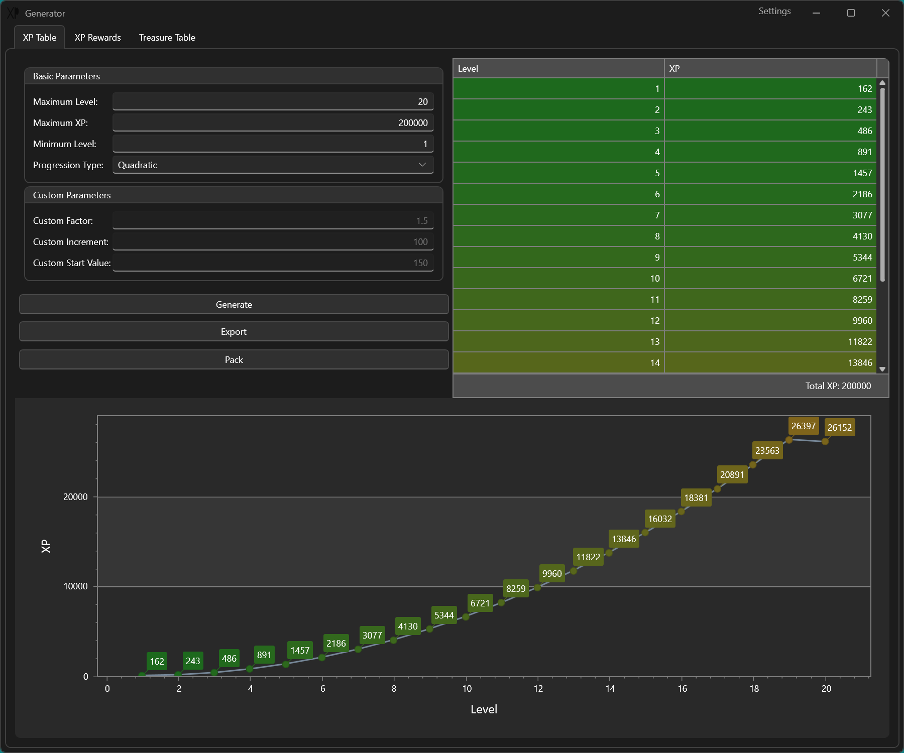

# BG3 XP Table Generator

This is a simple tool that generates expereince tables (Data.txt and XPData.txt) for Baldur's Gate 3 in the required format.

The main UI looks as follows:

## Requirements

[.NET 7 Runtime](https://dotnet.microsoft.com/en-us/download/dotnet/7.0)

## How-To

1. Enter the required maximum XP number (the game's default is 420000);
2. Enter the required number of levels (the game's default is 12);
3. Click Generate;
4. Analyze generated data. You can adjust numbers in the grid if something looks off (**early levels especially**);
4. Click Export and select an export location.

You'll find two generated files in the set location.

## What's Next?

Use a packaging tool ([LSLib](https://github.com/Norbyte/lslib)) to create a mod with your XP tables or place them in the override directory. Do not forget to create the required folder structure:

`Public\Mod_Name\Stats\Generated\Data\XPData.txt`

`Public\Mod_Name\Stats\Generated\Data\Data.txt`

## P.S.

This tool uses a simple and straightforward linear progression curve. If you feel like you can come up with another solution, please feel free to submit a pull request.
